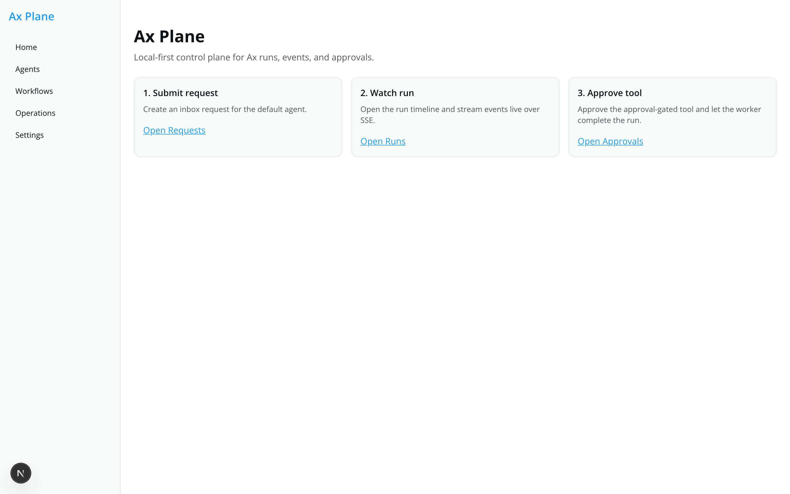
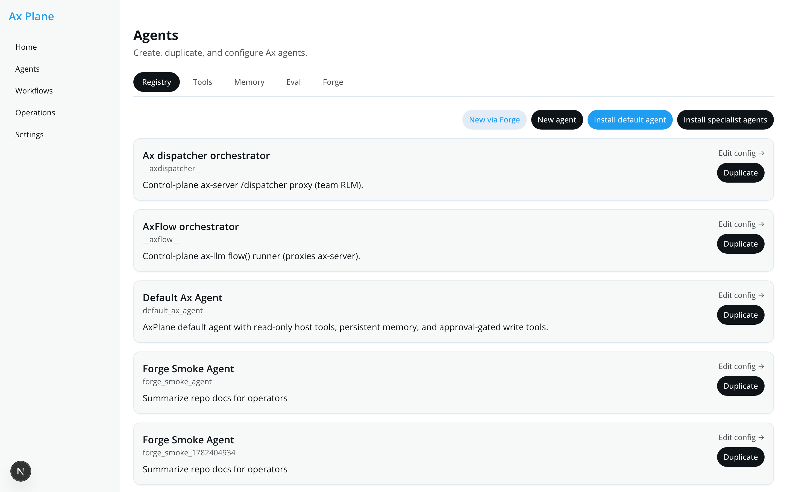
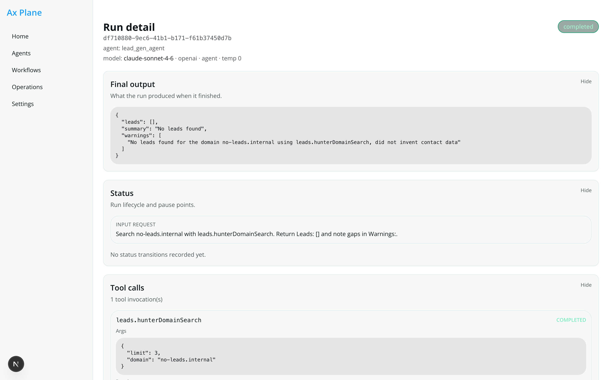
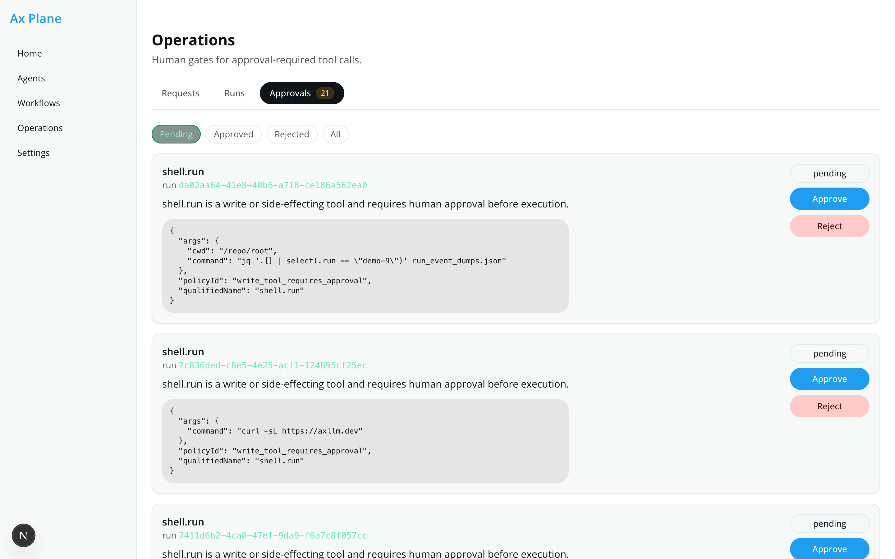
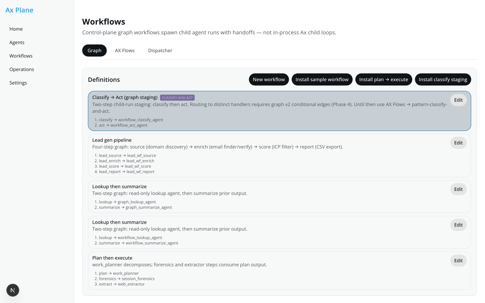
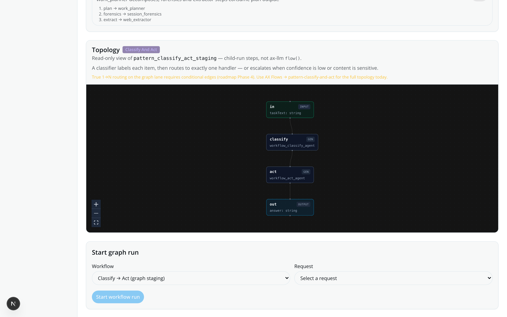
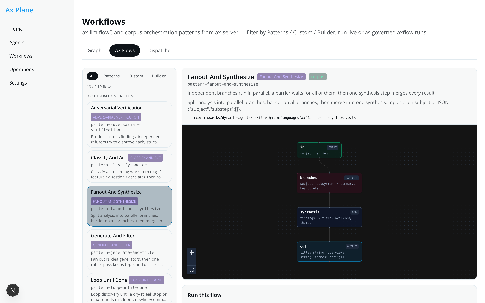
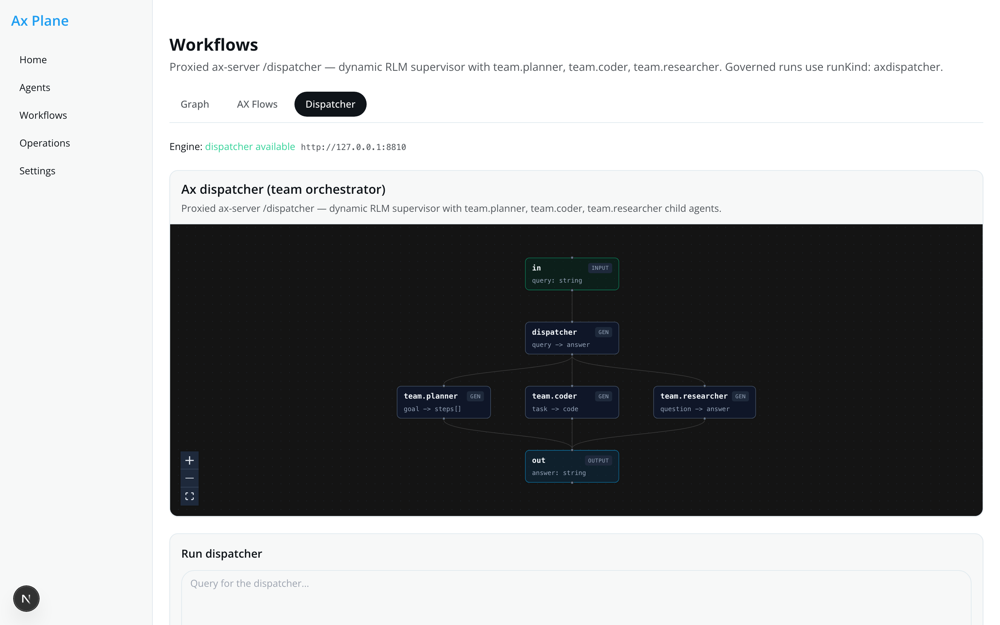
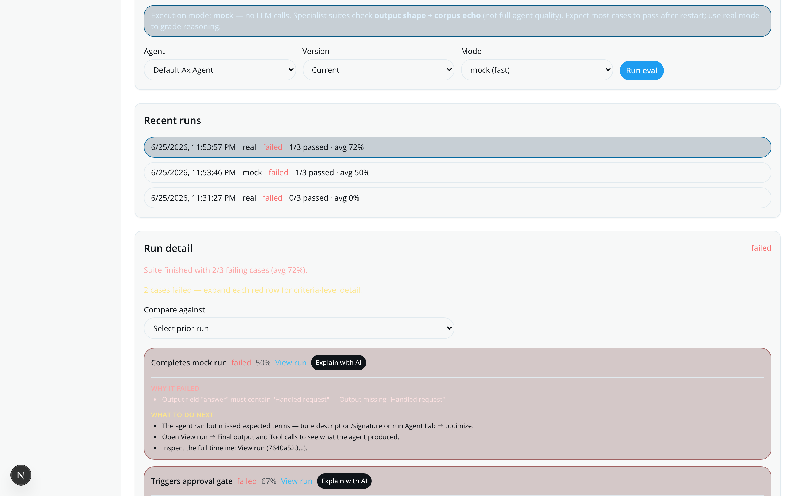

# Ax Plane

**A local-first control plane for [`@ax-llm/ax`](https://github.com/ax-llm/ax).**

Ax Plane is the operations layer around Ax: requests, agent configs, durable run history, human approval gates, eval suites, and multi-step workflows — with a Next.js dashboard that streams run events live over SSE.

> **Ax** = signatures, tool calling, RLM pipelines, `agent.optimize()`, `flow()`  
> **Ax Plane** = Postgres-backed runs, policy, approvals, routing, eval lab, and the UI that ties it together

The dashboard **never calls Ax directly**. Every LLM execution goes through a worker:

```txt
web → API → worker → @axplane/runtime → @axplane/ax-adapter → host tools → Postgres events → SSE → dashboard
```

MIT licensed · runs on your machine · mock mode works with **no API key**

---

## Screenshots

<p align="center">
  
</p>

| Agents registry | Run detail |
| :---: | :---: |
|  |  |

| Approvals queue | Workflows hub |
| :---: | :---: |
|  |  |

| Graph workflow canvas | AX Flows (pattern catalog) |
| :---: | :---: |
|  |  |

| AX Dispatcher (team orchestrator) | Eval lab |
| :---: | :---: |
|  |  |

More captures: [`docs/screenshots/`](docs/screenshots/) (requests inbox, runs list, agent editor, Forge).

Regenerate locally while the dev stack is up on `:3010`:

```bash
npx -p playwright node scripts/capture-demo-screenshots.mjs
```

---

## Quick start

```bash
git clone https://github.com/toasterman234/ax-plane.git
cd ax-plane
corepack enable && corepack prepare pnpm@9.15.4 --activate
cp .env.example .env
docker compose up -d    # Postgres (default host port 5433)
pnpm install
pnpm db:migrate
pnpm db:seed
pnpm dev
```

| Service | URL |
|---------|-----|
| Dashboard | http://localhost:3010 |
| API health | http://localhost:8797/health |

**First run (mock mode, no keys):**

1. Confirm the green API banner at the top of the dashboard.
2. **Agents → Install default agent**
3. **Operations → Requests** → submit a task mentioning `fake risky tool`
4. **Start run** → open run detail → watch events stream live
5. When status is `needs_approval` → **Operations → Approvals** → approve → run completes

```bash
pnpm test && pnpm typecheck && pnpm build   # validate the stack
```

### Real Ax mode (optional)

```bash
AXPLANE_EXECUTION_MODE=real
AXPLANE_REAL_STRATEGY=native          # recommended: ax() + native tools
OPENAI_API_KEY=sk-...                 # or AX_BASE_URL + AX_API_KEY for any OpenAI-compatible endpoint
AX_MODEL=gpt-4o-mini
```

RLM / `agent()` JS-runtime path: `AXPLANE_REAL_STRATEGY=rlm` and set agent `mode: rlm` in the editor.

---

## Dashboard map

The sidebar has five top-level areas. Each hub has sub-tabs for related features.

| Section | Route | What it's for |
|---------|-------|---------------|
| **Home** | `/` | Onboarding checklist — submit → watch → approve |
| **Agents** | `/agents/*` | Agent registry, tools, memory, eval, forge, per-agent editor & lab |
| **Workflows** | `/workflows/*` | Graph child-run pipelines, Ax `flow()` proxy, team dispatcher proxy |
| **Operations** | `/operations/*` | Request inbox, run history, approval queue |
| **Settings** | `/settings/*` | Theme lab (dashboard appearance) |

Legacy URLs (`/requests`, `/runs`, `/tools`, etc.) redirect into the Operations and Agents hubs.

---

## Home (`/`)

A three-step getting-started card layout:

1. **Submit request** — create work in the Operations inbox  
2. **Watch run** — open a run and stream its event timeline  
3. **Approve tool** — unblock approval-gated tool calls  

Use this page when demoing Ax Plane to someone new. Everything else in the app hangs off these three primitives.

---

## Agents hub (`/agents`)

Manage *who* runs your work: agent definitions, tools, memory, evaluation, and the Forge wizard.

### Registry (`/agents`)

The agent catalog.

| Action | What it does |
|--------|--------------|
| **Install default agent** | Seeds `default_ax_agent` — a starter config with routing keywords and demo tools |
| **New agent** | Create from **Starter** (read-only tools) or **Full** (entire host tool catalog) template |
| **New via Forge** | Jump to the guided agent builder |
| **Duplicate** | Clone an agent under a new id with a fresh version history |
| **Edit config** | Open the per-agent editor |

Each agent has: id, name, description, enabled flag, and a **versioned config** (signature, tools, routing, models). Runs pin the agent version at start time — edits never affect in-flight runs.

---

### Agent editor (`/agents/:id`)

The control center for a single agent. Two tabs: **Config** and **Agent Lab**.

#### Config tab

| Card | Fields & behavior |
|------|-------------------|
| **Identity** | Name, description, Ax **signature** string, **mode** (`normal` or `rlm` for `agent()` pipeline), **runtime** (`ax` — the only wired runtime) |
| **Tools** | Enable/disable tools by namespace (`repo`, `github`, `docs`, `shell`, `memory`, `fake`, `http`). Risk badges: **read-only** vs **approval required** |
| **Routing** | Comma-separated **keywords**, numeric **priority** (tie-breaker), **default agent** checkbox when no keyword matches |
| **Models** | Per-agent **primary** and **fallback** slots: provider, model, temperature. Blank = inherit from `.env` |
| **Policies & context** | Policy toggles (`write_tool_requires_approval`, `block_secret_exfiltration`, etc.) and RLM **context preset** / **budget** |
| **Version history** (sidebar) | Browse past versions, preview read-only, **restore** into editor, **Save new version** to publish |

**Save new version** creates an immutable `agent_versions` row and sets it current. Historical versions are never mutated.

---

### Agent Lab (`/agents/:id` → Lab tab)

Per-agent **eval → optimize → compare → promote** loop using [`agent.optimize()`](https://axllm.dev) when in real mode.

| Step | UI action | Backend |
|------|-----------|---------|
| Seed eval suite | Install smoke suite | `POST /agents/:id/lab/suites/seed-smoke` |
| Baseline | Run baseline eval (mock or real) | `POST /agents/:id/lab/baseline-eval` |
| Optimize | Run optimizer (`ax-native-mock` or `ax-native`) | `POST /agents/:id/lab/optimize` |
| Compare | Side-by-side baseline vs candidate metrics (score, turns, tool mistakes, cost) | Comparison panel |
| Promote / Reject | Promote winning candidate → new agent version | `POST .../candidates/:id/promote` |

Mock optimizer works without API keys. `ax-native` calls real `agent.optimize()` through the worker.

---

### Tools (`/agents/tools`)

Global tool registry — what agents *can* call.

**Built-in host tools** (executed on the worker host, sandboxed by policy):

| Namespace | Tools | Default risk |
|-----------|-------|--------------|
| `repo` | `listFiles`, `readFile`, `search`, `writeFile` | read = safe · write = approval |
| `docs` | `search` | safe |
| `github` | `searchIssues`, `readIssue`, `readFile`, `createIssue`, `createBranch`, `createPR` | read = safe · create* = approval |
| `shell` | `run` | approval |
| `memory` | `save`, `search`, `list` | safe |
| `fake` | `projectLookup`, `riskyAction` | lookup = safe · risky = approval (demo) |
| `http` | Custom webhooks you register | configurable |

**Register HTTP tool** — define `http.{name}` with method, URL template, optional JSON body template, and `{{payload}}` substitution. Risky HTTP tools require approval like writes.

Enable tools per agent in the editor; registration here only adds them to the catalog.

Configure sandbox roots in `.env`:

```bash
AXPLANE_REPO_ROOT=/path/to/repo
AXPLANE_DOCS_ROOT=/path/to/docs
GITHUB_TOKEN=ghp_...
GITHUB_REPO=owner/repo
```

---

### Memory (`/agents/memory`)

Persistent recall across runs — Ax Plane's substitute for Ax `recall()`.

| Feature | Description |
|---------|-------------|
| **Seed memory** | Manually add entries with tags; scope **global** or **agent-specific** |
| **Browse / search** | Filter by agent, full-text search |
| **Kernel inject** | Agents with `memory.kernelInject: true` auto-search relevant entries at run start; emits `memory.injected` on the run timeline |
| **Runtime tools** | Agents can call `memory.save`, `memory.search`, `memory.list` during runs |

---

### Eval (`/agents/eval`)

Cross-agent evaluation lab (distinct from per-agent Agent Lab).

| Feature | Description |
|---------|-------------|
| **Suites** | Named collections of cases (task text + scoring criteria) |
| **Install smoke suite** | One-click demo suite |
| **Run suite** | Pick agent, optional pinned version, **mock** (fast/deterministic) or **real** (calls LLM) |
| **Run detail** | Per-case pass/fail, score %, link to underlying Ax run |
| **Compare** | Delta vs a prior eval run on the same suite |

Deterministic scoring checks tool usage, output shape, and rubric criteria — not LLM-as-judge by default.

---

### Forge (`/agents/forge`)

Guided **intake → scaffold → commit → optimize** workflow for new agents.

| Step | What happens |
|------|--------------|
| **Intake** | Task description, success/failure criteria, tool intents (read/write/shell/memory/http), judgment style, volume |
| **Scaffold** | Heuristic or **LLM-assisted** draft of signature, tools, and eval cases |
| **Review** | Edit draft before commit |
| **Commit** | Creates agent + eval suite; optional baseline eval |
| **Optimize** | Optional mock or real optimization pass |

Works end-to-end in **mock mode** without API keys. Resume sessions via `?session=` URL param.

---

## Workflows hub (`/workflows`)

Three orchestration lanes — all produce **governed runs** stored in Postgres with live SSE timelines.

### Graph workflows (`/workflows`)

**Fixed multi-agent pipelines** as control-plane **child runs** (not in-process Ax child agents).

| Feature | Description |
|---------|-------------|
| **Definitions list** | All saved graph workflows; **pattern badges** when a workflow implements a canonical topology |
| **New workflow / builder** | Linear step editor: each step binds an agent + input template |
| **Install sample** | `lookup_summarize` — lookup agent → summarize agent |
| **Install classify staging** | `pattern_classify_act_staging` — two-step classify → act graph with bundled agents (staging for classify-and-act; true 1→N routing needs graph Phase 4) |
| **Pattern + v2 metadata** | Workflows can store optional `pattern` tag and `definition_json` (v2 DAG design; executor still runs linear `steps[]` until Phase 3–4) |
| **Topology canvas** | Read-only flow diagram with pattern blurbs and classify-and-act routing notes |
| **Start workflow run** | Pick a Request → queues parent run; worker spawns child runs per step |
| **Run detail** | Parent shows **Graph steps** with child run links and statuses |

Child step hitting `needs_approval` pauses the parent until you approve on the child run.

For the full **classify-and-act** topology (classifier → distinct handlers), use **AX Flows → `pattern-classify-and-act`** on ax-server. Graph lane is sequential child-run staging until conditional edges ship.

---

### AX Flows (`/workflows/ax-flows`)

**Declarative Ax `flow()` programs** and **corpus orchestration patterns** proxied from an external ax-server.

| Feature | Description |
|---------|-------------|
| **Flow catalog** | Lists flows registered on ax-server (`GET /ax-flows`) |
| **Catalog filters** | **All** · **Patterns** (corpus `pattern-*` flows) · **Custom** · **Builder** — grouped sections when viewing all |
| **Pattern badges** | Violet topology tags (classify-and-act, fanout-and-synthesize, etc.) plus corpus / builder source chips |
| **Pattern blurbs** | Operator-facing one-liners per canonical topology in the detail header |
| **Structure canvas** | Read-only `FlowSpec` diagram per flow (empty-state safe; auto fit-view) |
| **Engine run history** | Past ax-server runs for a flow |
| **Run live** | SSE stream through API proxy — watch steps light up on canvas |
| **Queue governed run** | Attach to a Request → `runKind: axflow` → full Postgres event log + run detail |

**Six corpus patterns** (from [dynamic-agent-workflows](https://github.com/rawwerks/dynamic-agent-workflows), ported as `pattern-*` on ax-server): classify-and-act, fanout-and-synthesize, adversarial-verification, generate-and-filter, tournament, loop-until-done. See [`docs/patterns/`](docs/patterns/).

**Requires ax-server** at `AX_SERVER_URL` (default `http://127.0.0.1:8810`). Without it, catalog is empty but graph workflows and single-agent runs still work.

---

### Dispatcher (`/workflows/dispatcher`)

**Dynamic team RLM** proxied from ax-server `/dispatcher` (supervisor + `team.planner`, `team.coder`, `team.researcher`, etc.).

| Feature | Description |
|---------|-------------|
| **Team topology canvas** | Static diagram of dispatcher child agents |
| **Run live** | SSE query stream with route decisions, delegations, turns |
| **Queue governed run** | `runKind: axdispatcher` — durable timeline on run detail |
| **Availability badge** | Green when ax-server exposes `/dispatcher` |

Complex queries can run for minutes on ax-server. Use short smoke queries (`"hey"`) when testing.

---

## Operations hub (`/operations`)

The runtime inbox — where work enters and gets executed.

### Requests (`/operations/requests`)

| Feature | Description |
|---------|-------------|
| **Submit** | Free-text task body |
| **Auto-route** | Router picks agent by keyword, default, or optional LLM classifier |
| **Force agent** | Skip routing — pin a specific agent on submit |
| **Auto-start** | Checkbox to create and queue a run immediately |
| **Route decision card** | Shows selected agent, strategy (`keyword` / `default` / `explicit` / `manual_override` / `llm`), reason, confidence |
| **Re-route** | Change agent assignment before starting |
| **Start run** | Queue single-agent run for this request |

**Router modes** (`.env`):

```bash
AXPLANE_ROUTER_MODE=keyword   # default: keywords then default agent
AXPLANE_ROUTER_MODE=hybrid    # keywords first, LLM fallback
AXPLANE_ROUTER_MODE=llm       # always classify with LLM
```

---

### Runs (`/operations/runs`)

All durable runs: single-agent, graph parents, axflow, axdispatcher.

Click any run → **Run detail** (`/runs/:id`).

#### Run detail sections

| Section | What you see |
|---------|--------------|
| **Header** | Status badge, agent id, run kind, model resolved, link to approvals when paused |
| **Final output** | Structured `answer` + `nextActions` or raw JSON |
| **Flow canvas overlays** | Graph / axflow / dispatcher topology with live trace highlighting (run-kind dependent) |
| **Graph steps** | Child runs for workflow parents |
| **Status** | Lifecycle transitions, resume-after-approval events |
| **Tool calls** | Each tool invocation with args, result, timing, policy outcome |
| **Approvals** | Inline approval requests tied to this run |
| **Actor turns** | Model turns in the RLM path |
| **Chat log** | Captured `getChatLog()` from Ax |
| **Usage** | Token usage from `getUsage()` / `getStagedUsage()` |
| **Traces** | Ax internal traces when available |
| **Event log** | Raw durable `run_events` stream (newest via SSE `onmessage`) |

Runs stream live — no refresh needed. Statuses include `queued`, `running`, `needs_approval`, `completed`, `failed`, `cancelled`.

---

### Approvals (`/operations/approvals`)

Human-in-the-loop gates for side-effect tools.

| Feature | Description |
|---------|-------------|
| **Filter tabs** | pending · approved · rejected · all |
| **Pending badge** | Count on Operations hub tab |
| **Approval card** | Tool name, run link, reason, full requested-action JSON |
| **Approve / Reject** | Worker resumes run **without full rerun** — idempotent tool replay from approval point |

Policy engine classes:

- **Allow** — read-only tools execute immediately  
- **Approval required** — writes, shell, risky HTTP, `fake.riskyAction`, GitHub mutations  
- **Block** — secrets in tool args (`sk-`, `ghp_` patterns)  

---

## Settings hub (`/settings`)

### Theme lab (`/settings/themes`)

Dashboard appearance playground (not agent runtime).

| Feature | Description |
|---------|-------------|
| **Theme presets** | Twitter-light and others |
| **Font presets** | Sans/mono stacks |
| **Radius presets** | Border radius tokens |
| **Live preview** | Sample cards and buttons |
| **Copy CSS snippet** | Paste into `apps/web/app/globals.css` |

---

## Execution modes

| Mode | Env | Use case |
|------|-----|----------|
| **Mock** | `AXPLANE_EXECUTION_MODE=mock` (default) | Deterministic demo — no LLM, no keys. Full UI + approval flow. |
| **Real native** | `AXPLANE_EXECUTION_MODE=real` + `AXPLANE_REAL_STRATEGY=native` | Production path: `ax(signature, { functions })` + host tools |
| **Real RLM** | `AXPLANE_REAL_STRATEGY=rlm` + agent `mode: rlm` | `agent()` JS-runtime pipeline |

Mock router uses a deterministic classifier. Real router calls `ax()` to pick the best agent from your catalog.

---

## What Ax Plane adds vs raw Ax

| Ax Plane layer | Raw `@ax-llm/ax` |
|----------------|------------------|
| Request inbox + routing | You wire routing yourself |
| Versioned agent configs in Postgres | YAML/code in repo |
| Durable `run_events` + SSE dashboard | Console / custom logging |
| Approval gates + resume | Manual intervention |
| Host tool sandbox + policy | You implement tool guards |
| Eval suites + Agent Lab | `agent.optimize()` in scripts |
| Graph child-run workflows | In-process patterns or custom orchestration |
| Pattern-tagged graph metadata + v2 DAG design | Full DAG executor + conditional edges (roadmap Phase 3–4) |
| Governed axflow / dispatcher proxy | Direct ax-server calls |

See [`docs/ax-surface-map.md`](docs/ax-surface-map.md) for a full grid of axllm.dev capabilities vs Ax Plane.

---

## Architecture

```txt
apps/web        Next.js dashboard (port 3010)
apps/api        Hono REST + SSE (port 8797)
apps/worker     Polls queued runs, executes agents, graph/axflow/dispatcher proxies

packages/db           Drizzle schema, migrations, repositories
packages/events       Normalized event taxonomy
packages/policy       allow / block / approval_required
packages/host-tools   repo, docs, github, shell, memory, HTTP tools
packages/agents       Agent config, routing, models, templates
packages/router       Keyword + optional LLM request routing
packages/runtime      RuntimeAdapter facade
packages/ax-adapter   Mock + real Ax runner, optimize, memory inject
packages/lab          Agent Lab optimizer workflow
packages/forge        Agent Forge intake workflow
packages/memory       Kernel inject, memory tool execution
packages/eval         Deterministic eval scoring
packages/graph        Graph workflow definitions + executor + v2 DAG types (`linearStepsToV2`, pattern staging)
packages/flow-canvas  Read-only flow diagrams, axflow/dispatcher overlays, pattern catalog helpers
```

---

## Optional integrations

| Integration | Required for | Config |
|-------------|--------------|--------|
| **Postgres** | Everything | `docker compose up -d` · `DATABASE_URL` |
| **OpenAI-compatible API** | Real mode | `OPENAI_API_KEY` or `AX_BASE_URL` + `AX_API_KEY` |
| **ax-server** | AX Flows + Dispatcher tabs | `AX_SERVER_URL=http://127.0.0.1:8810` |
| **GitHub** | `github.*` tools | `GITHUB_TOKEN`, `GITHUB_REPO` |

Single-agent mock mode + graph workflows need **only Postgres**.

---

## Not yet implemented

- Cron / delayed run scheduling  
- Workflow delete, parallel branches, conditional edges, visual DAG editor  
- Graph v2 **executor** (v2 `definition_json` is stored; linear `steps[]` still runs)  
- MCP / `discover()` / `recall()` (memory kernel + host tools instead)  
- Top-level GEPA `optimize()` on arbitrary programs  
- LLM token streaming to the UI (SSE streams **run events**, not tokens)  
- Audio / multimodal  

Roadmaps: [`docs/workflows-roadmap.md`](docs/workflows-roadmap.md) · [`docs/agent-forge-roadmap.md`](docs/agent-forge-roadmap.md) · [`docs/patterns/`](docs/patterns/)

---

## Docs index

| Doc | Contents |
|-----|----------|
| [`HANDOFF.md`](HANDOFF.md) | Operator brief, gotchas, API reference |
| [`docs/ax-surface-map.md`](docs/ax-surface-map.md) | axllm.dev vs Ax Plane capability grid |
| [`docs/flow-canvas.md`](docs/flow-canvas.md) | Canvas package + axflow/dispatcher proxy |
| [`docs/workflows.md`](docs/workflows.md) | Graph child-run workflows |
| [`docs/patterns/`](docs/patterns/) | Six corpus orchestration patterns — rosetta, conformance, graph reference |
| [`docs/agent-lab.md`](docs/agent-lab.md) | Optimize / compare / promote |
| [`docs/agent-forge.md`](docs/agent-forge.md) | Forge product brief |
| [`docs/router-llm.md`](docs/router-llm.md) | LLM request routing |

---

## License

MIT — see [`LICENSE`](LICENSE).

Built for teams using **[@ax-llm/ax](https://github.com/ax-llm/ax)** who want a local control plane without standing up a full platform. Questions and PRs welcome.
