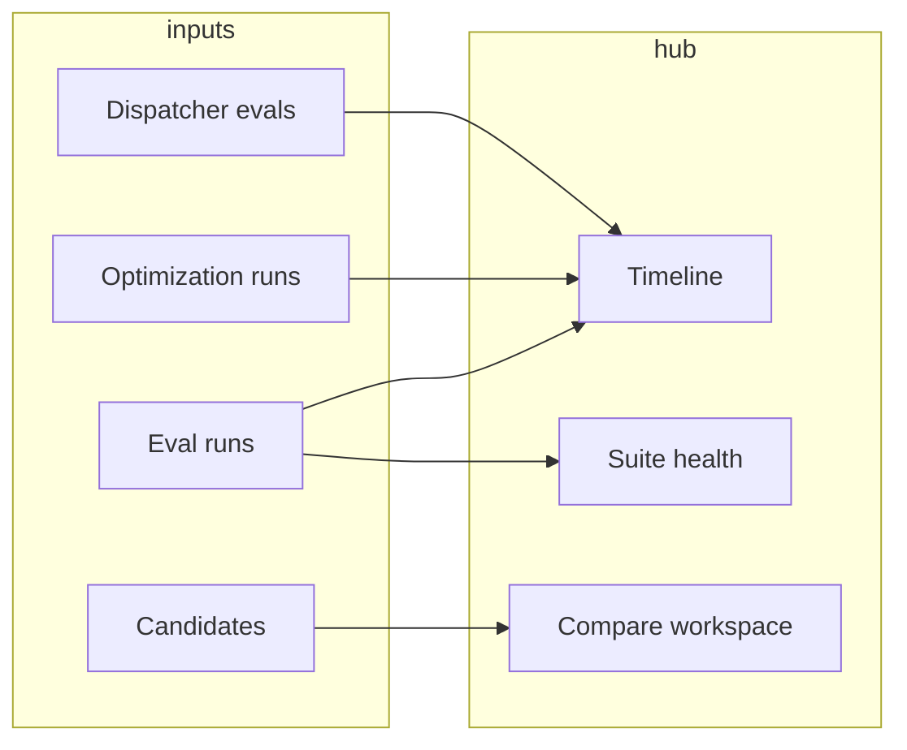

# Experiments hub — eval & optimization visualization plan

> **Status:** Proposal — tracked in GitHub issue [#10](https://github.com/toasterman234/ax-plane/issues/10) (filed 2026-06-26).  
> **Related:** `docs/agent-lab.md`, `docs/agent-forge.md`, `docs/ax-surface-map.md`, dispatcher routing eval (issue #6)  
> **Downstream:** Agent Lab (action surface) stays; Experiments hub is the analysis surface.

**Sync rule:** When a phase ships, update this file, `HANDOFF.md` §2 + §12, and `docs/ax-surface-map.md` (Experiments / GEPA viz rows).

---

## Problem

Ax Plane already has a working **eval → optimize → compare → promote** loop (Eval lab, Agent Lab, Forge optimize step, dispatcher routing eval). Data lands in Postgres (`eval_runs`, `optimization_runs`, `agent_candidates`) and comparison math exists in `@axplane/lab` (`buildEvalComparison`, `metricsFromEvalRun`).

What's missing is **situational awareness**: no unified history view, no case-level regression matrix, no optimization trial timeline, and no Pareto visualization — even though `optimizeAxAgent` already records `paretoFrontSize`.

Today eval/optimization UX is split across three surfaces with inconsistent depth:

| Surface | Route | Strength | Gap |
|---------|-------|----------|-----|
| Eval lab | `/agents/eval` | Suites, per-case pass/fail, run-to-run delta | No charts, no regression view |
| Agent Lab | `/agents/:id` → Lab | Baseline → optimize → compare → promote | Text metrics only; Pareto not shown |
| Dispatcher eval | `/workflows/dispatcher` | Live polling, per-case paths/latency | Best eval UX — dispatcher-only |

**Architectural constraint (unchanged):** web reads Postgres via API only; never calls Ax directly.

---

## Recommendation

Add an **Experiments hub** under Agents — analysis surface; keep Agent Lab as the action surface.

```txt
/agents/experiments          ← new hub (timeline + compare workspace + suite health)
/agents/eval                 ← run suites (existing; gains heatmap + trends in Phase A)
/agents/:id → Agent Lab      ← optimize / promote (existing; gains radar + case delta in Phase B)
/workflows/dispatcher        ← routing eval (existing; linked from Experiments timeline)
```



---

## Visualization scope (by phase)

### Phase A — read-only on existing tables (no schema change) ✅ shipped 2026-06-26

| Viz | Answers | Status |
|-----|---------|--------|
| **Case × run heatmap** | Which cases regressed or improved across runs? | ✅ `/agents/eval` Insights panel |
| **Score trend** | Did agent version N actually beat N−1 on this suite? | ✅ SVG chart on eval page |
| **Dispatcher-style case rows** | Per-case status, score, criterion breakdown | ✅ expandable `EvalCaseRow` |

API: `GET /eval/runs?suiteId=&agentId=&limit=`, `GET /eval/suites/:id/matrix?agentId=&limit=`.
Package: `@axplane/eval` `buildEvalMatrix`.

### Phase B — Agent Lab comparison upgrade (no schema change) ✅ shipped 2026-06-26

| Viz | Answers | Status |
|-----|---------|--------|
| **Multi-metric comparison** | Score, pass rate, turns, tool mistakes, cost | ✅ grouped bars in Agent Lab |
| **Per-case delta table** | Sort cases by score delta; flag regressions | ✅ sortable table + run links |

Package: `@axplane/eval` `buildCaseComparisonRows`, `comparisonMetrics`.
Components: `metric-comparison-chart.tsx`, `per-case-delta-table.tsx`.

Uses existing `buildEvalComparison()` + eval run case results.

### Phase C — Experiments hub (minimal new read APIs) ✅ shipped 2026-06-26

| View | Answers | Status |
|------|---------|--------|
| **Timeline** | Eval + optimization + dispatcher activity | ✅ `/agents/experiments` |
| **Compare workspace** | 2+ eval runs on same suite → heatmap | ✅ Compare tab |
| **Suite health** | Regression + flaky flags per case | ✅ Suite health tab |

API: `GET /experiments/timeline`, `/experiments/suite-health`, `/experiments/compare`.
Package: `@axplane/experiments`.

### Phase D — optimization internals (schema + API)

| Viz | Answers |
|-----|---------|
| **Trial timeline** | Score vs trial #, accept/reject strip, metric-call budget burn |
| **Pareto scatter** | Multi-objective trade-offs (accuracy vs brevity vs cost) |
| **Candidate component diff** | `componentMap` instruction changes before promote |

Requires persisting `paretoFront` and trial steps from `agent.optimize()` / future `AxGEPA`.

### Phase E — AxGEPA (future optimizer path)

Same Experiments primitives; optimizer runs via `AxGEPA.compile()` on `flow()` / `ax()` / agent trees. Marked ❌ in `docs/ax-surface-map.md` today.

### Explicit non-goals

- W&B-style experiment tracking platform
- Embedded Langfuse charts (link out to trace instead)
- Web → Ax direct calls

---

## Experiments page — component map

**Route:** `/agents/experiments`  
**Layout:** extends Agents hub shell (same nav as `/agents/eval`, `/agents/forge`).

```txt
apps/web/app/agents/experiments/
├── page.tsx                      # hub shell: filters + tab routing
├── experiments-filters.tsx       # agentId, suiteId, date range, run kind
├── experiments-timeline.tsx      # Phase C — unified activity feed
├── experiments-compare.tsx       # Phase C — multi-run compare workspace
├── suite-health-panel.tsx        # Phase C — flaky/regression summary
├── case-heatmap.tsx              # Phase A — reusable (also embedded in /agents/eval)
├── score-trend-chart.tsx         # Phase A — reusable
├── metric-comparison-chart.tsx   # Phase B — radar or grouped bars
├── per-case-delta-table.tsx      # Phase B/C — sortable case diff
├── optimization-trial-chart.tsx  # Phase D — trial timeline + budget
├── pareto-scatter.tsx            # Phase D — multi-objective frontier
├── candidate-diff-panel.tsx      # Phase D — componentMap instruction diff
└── lib/
    └── experiments-types.ts      # shared TS types mirroring API responses
```

**Shared / reused components**

| Existing | Reuse in Experiments |
|----------|---------------------|
| `@/components/ui/card`, `button` | All panels |
| `routing-eval-panel.tsx` patterns | Case row layout, live polling, summary strip |
| `eval-page.tsx` data hooks | Suite/run queries (extract to shared hook in Phase A) |
| `agent-lab.tsx` comparison types | `EvalComparison` shape |
| `/runs/[id]` link | Case drill-down |

**Tab structure (page.tsx)**

| Tab | Phase | Primary component |
|-----|-------|-------------------|
| Timeline | C | `experiments-timeline.tsx` |
| Compare | C | `experiments-compare.tsx` |
| Suite health | C | `suite-health-panel.tsx` |
| Optimization | D | `optimization-trial-chart.tsx` + `pareto-scatter.tsx` |

Phase A/B widgets ship first inside `/agents/eval` and Agent Lab; Experiments hub composes them in Phase C.

---

## API additions

All endpoints live in `apps/api`. Read paths first; writes only where noted.

### Phase A — extend existing eval endpoints (no new routes)

```txt
GET /eval/runs?suiteId=&agentId=&limit=   # ensure query params documented + used by UI
GET /eval/runs/:id                        # already returns results[] — sufficient for heatmap
```

Optional convenience (Phase A):

```txt
GET /eval/suites/:id/matrix?suiteId=&runIds=a,b,c
  → { cases: [{ id, name }], runs: [{ id, createdAt, agentVersionId }],
      cells: [{ caseId, runId, status, score }] }
```

Computed server`apps/api` from existing tables — avoids N+1 from the browser.

### Phase C — Experiments read API

```txt
GET /experiments/timeline?agentId=&suiteId=&kind=eval|optimization|dispatcher&limit=50
  → { items: ExperimentTimelineItem[] }

GET /experiments/suite-health?suiteId=&agentId=&windowDays=30
  → { cases: [{ caseId, name, latestScore, passRate, regressionFlag, runCount }] }

GET /experiments/compare?runIds=a,b[,c]
  → { runs: EvalRunDetail[], matrix: CaseMatrix, metrics: EvalRunMetrics[] }
```

`ExperimentTimelineItem` (sketch):

```typescript
type ExperimentTimelineItem = {
  id: string;
  kind: 'eval' | 'optimization' | 'dispatcher';
  agentId: string | null;
  suiteId: string | null;
  status: string;
  summary: { averageScore?: number; passed?: number; total?: number };
  createdAt: string;
  href: string; // deep link into eval / lab / dispatcher
};
```

Implementation: thin aggregator in `packages/lab` or new `packages/experiments` that queries existing repo methods — no new execution logic.

### Phase D — optimization detail API

```txt
GET /agents/:id/lab/optimization-runs/:runId
  → optimization run + trials[] + paretoFront[] + linked eval run ids

GET /agents/:id/lab/candidates/:candidateId/diff?baselineEvalRunId=
  → { componentDiffs: [{ key, before, after }], caseDeltas: [...] }
```

Populate on `POST …/lab/optimize` completion (extend `executeOptimizationWorkflow`).

### Phase D — optional Langfuse link (no API)

Case rows in real mode: `traceUrl` when `LANGFUSE_*` env present and run has external trace id (future; not blocking).

---

## Minimal schema changes

**Phase A–C:** none required.

**Phase D — migration `0007_optimization_trials.sql` (sketch):**

```sql
-- Extend optimization_runs with serialized optimizer output (JSON blobs, query-light)
ALTER TABLE optimization_runs
  ADD COLUMN IF NOT EXISTS trials_json jsonb,
  ADD COLUMN IF NOT EXISTS pareto_front_json jsonb,
  ADD COLUMN IF NOT EXISTS metric_budget_json jsonb;  -- { maxMetricCalls, usedMetricCalls }

-- Optional: normalized trials for SQL analytics (only if timeline queries need it)
CREATE TABLE IF NOT EXISTS optimization_trials (
  id                    uuid PRIMARY KEY DEFAULT gen_random_uuid(),
  optimization_run_id   uuid NOT NULL REFERENCES optimization_runs(id) ON DELETE CASCADE,
  trial_index           int NOT NULL,
  accepted              boolean NOT NULL DEFAULT false,
  scores_json           jsonb NOT NULL DEFAULT '{}',
  metric_calls_used     int,
  feedback_text         text,
  configuration_json    jsonb,
  created_at            timestamptz NOT NULL DEFAULT now()
);
CREATE INDEX optimization_trials_run_idx ON optimization_trials (optimization_run_id, trial_index);
```

**Write path change (`packages/ax-adapter/src/optimize-agent.ts`):**

- Today: `metrics: { paretoFrontSize }` only.
- Phase D: persist full `result.paretoFront` → `pareto_front_json`; map reflection rounds → `trials_json` or `optimization_trials` rows when Ax exposes them on `agent.optimize()` result.

**Phase D — extend `agent_candidates.metrics_json`:**

```typescript
// already jsonb — add structured keys without migration:
{
  comparison?: EvalComparison;
  paretoFront?: Array<{ scores: Record<string, number>; configuration?: unknown }>;
  trials?: Array<{ trial: number; scores: Record<string, number>; accepted: boolean }>;
}
```

Prefer `optimization_runs` as source of truth; copy summary onto candidate for promote UI.

---

## Package map (target)

```txt
packages/experiments   # Phase: timeline aggregation, suite health, matrix builders (Phase C)
packages/lab           # extend: persist trials/pareto in workflow (Phase D)
packages/ax-adapter    # extend: return full pareto + trials from optimizeAxAgent (Phase D)
packages/db            # migration 0007 (Phase D)
apps/api               # /experiments/* routes (Phase C), optimization detail (Phase D)
apps/web               # /agents/experiments + shared viz components (Phase A–D)
```

---

## Build order

| Phase | Deliverable | Schema | Effort |
|-------|-------------|--------|--------|
| **A** | Case := heatmap + score trend on `/agents/eval` | none | Small |
| **B** | Metric comparison chart + per-case delta in Agent Lab | none | Small |
| **C** | `/agents/experiments` hub + timeline / compare / suite health APIs | none | Medium |
| **D** | Trial timeline + Pareto scatter + candidate diff; persist optimizer output | 0007 | Medium |
| **E** | AxGEPA optimizer + same viz primitives | TBD | Larger |

**Reference UX:** `apps/web/app/workflows/dispatcher/routing-eval-panel.tsx` — live status, summary strip, expandable per-case rows.

---

## Acceptance criteria (Phase C MVP)

1. `/agents/experiments` loads a timeline of eval runs + optimization runs (+ dispatcher eval runs when present) for a selected agent.
2. Compare tab selects 2 eval runs on the same suite and shows case heatmap + score delta.
3. Suite health flags cases that failed in the latest run but passed in the prior run on the same suite.
4. All views are read-only; optimize/promote actions remain in Agent Lab.
5. `pnpm typecheck && pnpm test` green; no web → Ax calls.

---

## Links

- Eval lab docs: `docs/agent-lab.md` (Agent Lab loop + API)
- Forge downstream: `docs/agent-forge-roadmap.md` (optimize step feeds Agent Lab)
- Ax GEPA codegen reference: ben-agents3 `kilroy-control-plane/app/.claude/skills/ax-gepa/SKILL.md`
- Dispatcher eval pattern: issue #6, `packages/dispatcher-eval`, `routing-eval-panel.tsx`
