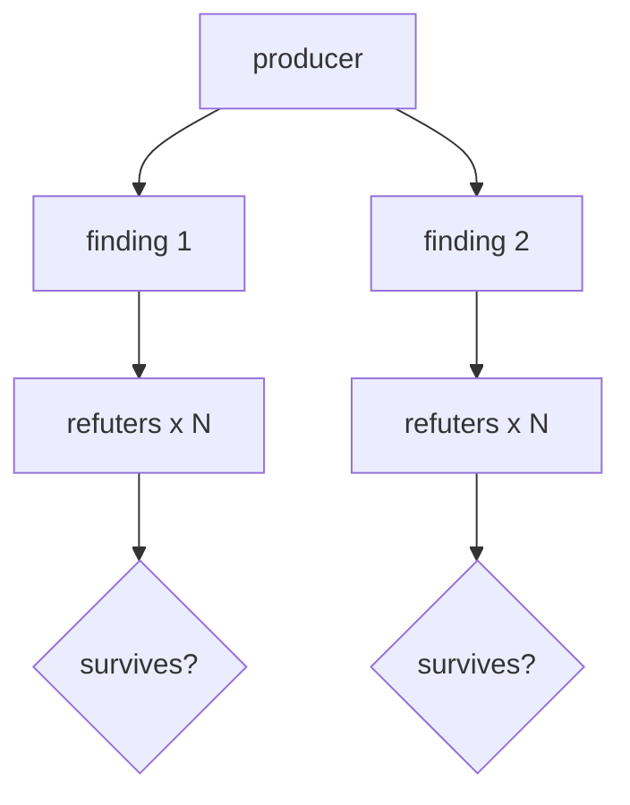

# Adversarial Verification

**Topology:** producer → per-item refuter bracket (parallel) → strict-minority survival filter.

## Load-bearing invariants

| ID | Property |
|----|----------|
| INV-1 | Per-item fan-out of refuters |
| INV-2 | Refuter firewall: only `{title, claim, rubric}` |
| INV-3 | Survives iff `2 * refuted < counted` (strict minority) |
| INV-4 | Adversarial framing: DISPROVE, never verify |
| INV-6 | Removal-only: confirmed ⊆ produced |

## Fixtures (INV-3 golden, no LLM)

- 0/3 refuted → survive
- 1/3 refuted → survive
- 2/3 refuted → kill
- all abstain → kill

## AxPlane

- **axflow:** `pattern-adversarial-verification`
- **eval/Forge:** adversarial case seeding (Phase D)

Upstream: `spec/adversarial-verification.spec.md`
