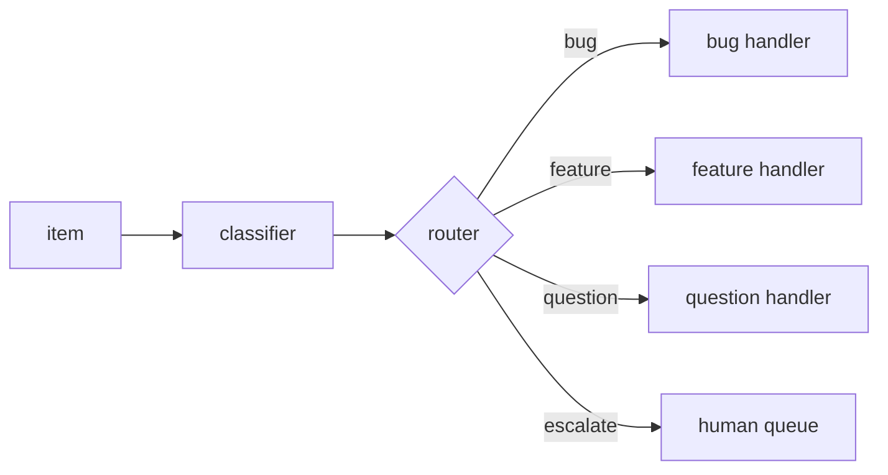

# Classify-And-Act

**Topology:** one classifier → router → exactly one handler (or escalate). No fan-out barrier.

## Load-bearing invariants

| ID | Property |
|----|----------|
| INV-1 | One classifier per item (read-only) |
| INV-2 | Exactly one route fires per item |
| INV-3 | Low confidence / sensitive → escalate |
| INV-4 | Classifier never takes high-privilege action |

## Fixtures (golden)

- `{ kind: bug, confidence: 0.9 }` → route `bug`
- `{ kind: feature, confidence: 0.49 }` → route `escalate`
- `classifier null` → route `escalate`

## AxPlane

- **axflow (canonical):** `pattern-classify-and-act`
- **graph (staging):** `pattern_classify_act_staging` — linear classify → act child runs; true branching needs graph Phase 4
- **v2 design:** `CLASSIFY_AND_ACT_GRAPH_V2` in `@axplane/graph`

Upstream: `spec/classify-and-act.spec.md`
