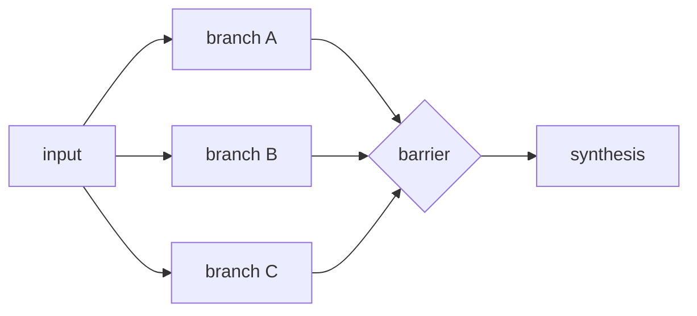

# Fanout-And-Synthesize

**Topology:** fan-out → **barrier** → single N→1 merge. Synthesis must consume all branch outputs.

## Load-bearing invariants

| ID | Property |
|----|----------|
| INV-1 | All branches complete before synthesis |
| INV-2 | Merge is N→1; nothing dropped on merge axis |
| INV-3 | `parts_merged == branch_count` (accounting) |

## Fixtures

- Two trivial branches → synthesis cites both
- One dead branch → dropped before merge; surviving count reflected

## AxPlane

- **axflow:** `pattern-fanout-and-synthesize`
- **graph:** requires Phase 3 parallel + join
- **informal:** `idea-council-flow` (custom tag)

Upstream: `spec/fanout-and-synthesize.spec.md`
