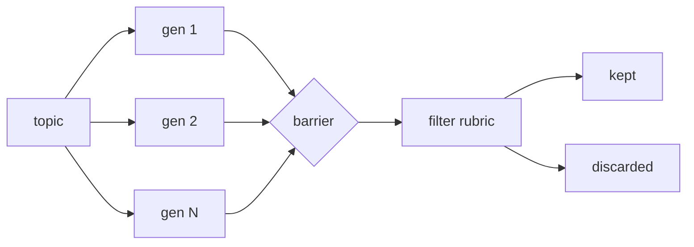

# Generate-And-Filter

**Topology:** barrier fan-out of generators → single rubric reducer → keep top-k, discard rest (not merge, not tournament).

## Load-bearing invariants

| ID | Property |
|----|----------|
| INV-1 | Barrier before filter (all candidates present) |
| INV-2 | Single reducing pass (not pairwise) |
| INV-3 | `kept + discarded == candidates_in` |
| INV-4 | Losers are discarded, not merged |

## AxPlane

- **axflow:** `pattern-generate-and-filter`
- **Agent Lab:** optimize/compare methodology (Phase D)

Upstream: `spec/generate-and-filter.spec.md`
