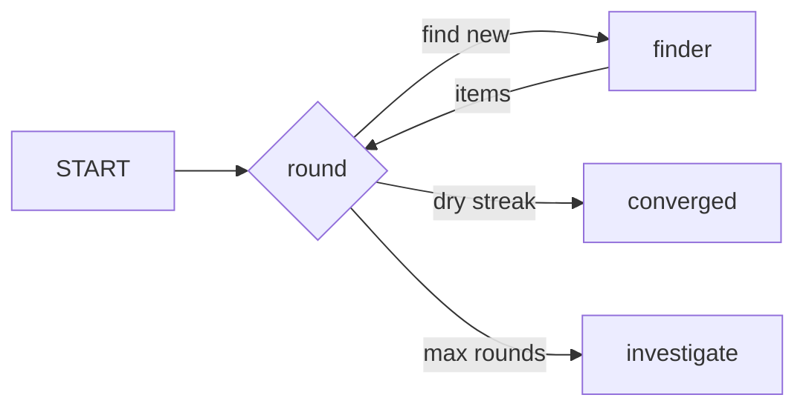

# Loop Until Done

**Topology:** loop with loop-carried state (`seen`, `dry_streak`) until dry-streak ≥ k or max-rounds rail.

## Load-bearing invariants

| ID | Property |
|----|----------|
| INV-1 | Stop predicate from runtime (not fixed N) |
| INV-2 | Dry streak resets on find |
| INV-3 | `stoppedBy` discriminant: dry-streak vs max-rounds |
| INV-4 | Finder excludes already-seen ids |

## AxPlane

- **axflow:** `pattern-loop-until-done`
- **graph:** subgraph re-entry needs v2 + loop executor (defer)

Upstream: `spec/loop-until-done.spec.md`
