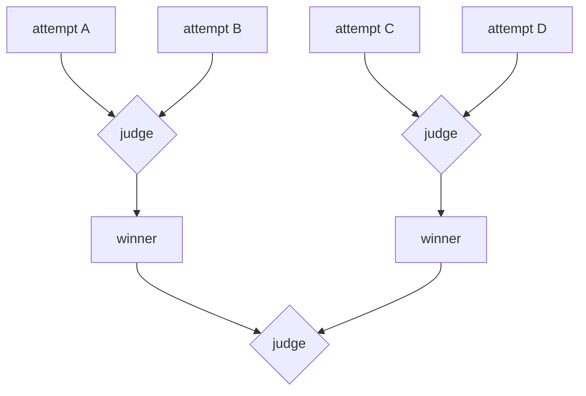

# Tournament

**Topology:** N whole-task attempts → iterated pairwise elimination with fresh judge per match → one champion.

## Load-bearing invariants

| ID | Property |
|----|----------|
| INV-1 | Fresh judge per match (no shared verdict memory) |
| INV-2 | Winner ∈ {A, B} relative comparison |
| INV-3 | Field halves each round until one remains |
| INV-4 | Not a single global rubric pass (≠ generate-and-filter) |

## AxPlane

- **axflow:** `pattern-tournament`
- **graph:** defer — bracket rounds awkward as linear child-runs

Upstream: `spec/tournament.spec.md`
